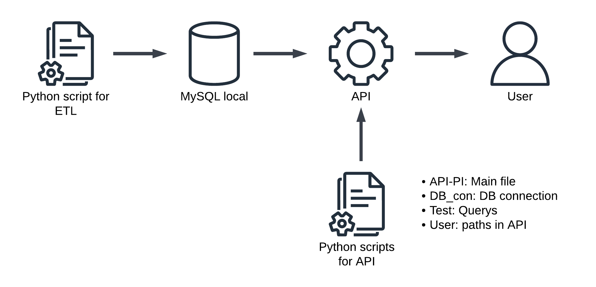

For this project, we obtained a few tables with information about racing cars from 1950 to 2021. Those tables had been received in formats as json and csv, and are the ones which are storaged in this GitHub in Datasets.

Our objective here is looking up at the data, and according to some deductions and requirementes, manipulate it. The idea behind manipulation, is cleaning the data to give the best information and structure, required for querys needed for final user.

First we crate an Python script for the ETL process, and once the information is load in Database we procedure to create de API.

It needs to clarify that the load data to SQL was made through the same python script, meanwhile API creation was made with differents scripts related to each other. 

Following is the working process schema

